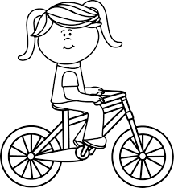
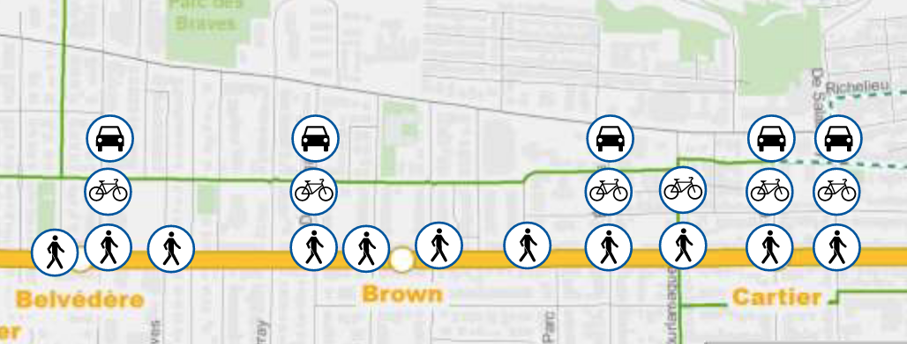
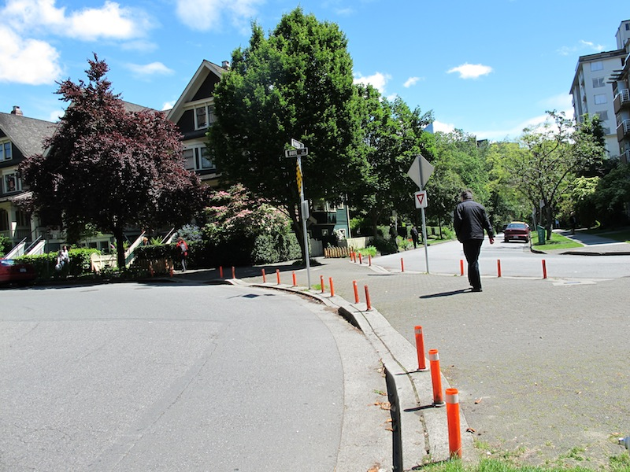
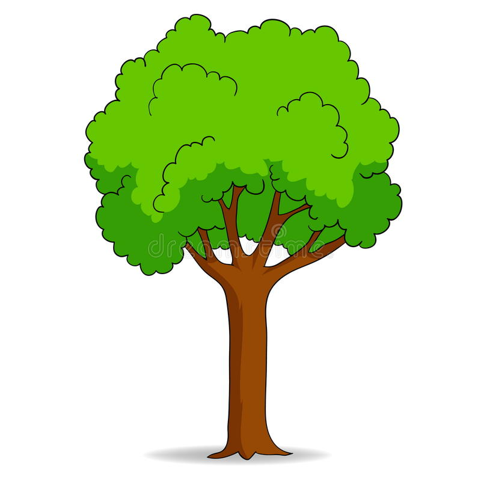
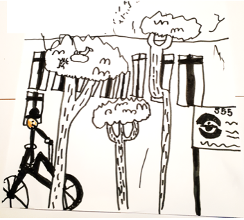

Le 28 mars 2022

À l'attention de 

Madame Catherine Vallières-Roland, conseillère du district de Montcalm-Saint-Sacrement, 

Madame Mélissa Coulombe-Leduc, conseillère du district du Cap-aux-Diamants, 

Monsieur Pierre-Luc Lachance, conseiller du district de Saint-Roch-Saint-Sauveur et 

Monsieur Bruno Marchand, maire de Québec.

À titre de parents et de membres de la communauté de l’école Anne-Hébert, nous aimerions vous faire part de nos souhaits concernant l'aménagement de notre secteur.

# Mise en contexte

Dans le cadre des travaux entourant l'insertion du tramway sur le boulevard René-Lévesque, la configuration de plusieurs rues de notre quartier sera modifiée et les citoyens devront modifier leurs habitudes.

Nous croyons qu'il s'agit d'une opportunité à saisir pour favoriser de saines habitudes de vie dont l'adoption du transport actif, en particulier pour les déplacements entre l'école et la maison des élèves du niveau primaire. Depuis 30 ans, la proportion des enfants d'âge primaire se déplaçant à pied ou à vélo est en constante régression (3), malgré les bienfaits avérés des déplacements actifs sur leur santé physique et mentale ainsi que sur leur autonomie. Il importe d'inverser cette tendance et l'école Anne-Hébert, du fait de la densité du secteur où elle est située, est dans un environnement exceptionnel pour servir de modèle d'aménagement urbain favorisant la mobilité active.

Au cours des dernières années, lorsque les parents de l'école ont été consultés au sujet du transport actif, leurs principales inquiétudes et réticences concernaient le non-respect de la signalisation et des limites de vitesse par les automobilistes (2). Ce constat n’est pas inusité : de nombreux autres rapports ont aussi identifié la crainte des dangers associés au trafic automobile comme principal frein à la marche vers l’école (3, 5, 6, 7, 8). En outre, la crainte d’une augmentation de la circulation automobile a été soulevée par plusieurs citoyens lors des récentes consultations au sujet de l’insertion de tramway dans le secteur (4). En effet, en l’absence d’aménagements adéquats, une augmentation de la circulation dans les rues de Montcalm est à craindre, ce qui viendrait interférer davantage avec le déplacement sécuritaire des écoliers.

Nous saluons la volonté de l'administration municipale de faire du quartier Montcalm une zone apaisée.  Aussi, nous reconnaissons l'expertise de la Ville et de ses partenaires pour choisir les meilleurs aménagements. Toutefois, par le passé, des solutions optimales pour la sécurité des personnes et la qualité de vie dans le quartier ont été écartées au nom du maintien de la fluidité automobile. Nous craignons que le poids de la culture nord-américaine du tout à l'auto - dont il est impératif de s'extirper - et les voix fortes qui la défendent poussent votre administration vers des compromis malheureux.

Nous souhaitons que l'implantation du tramway soit l'occasion pour l'administration municipale d'opérer un changement de paradigme visant l'établissement d'une collectivité viable (1) en favorisant, entre autres, les déplacements actifs et autonomes des enfants du quartier.

 

# Nous souhaitons:

### 1) Des mesures d'apaisement de la circulation contraignant la vitesse des voitures dans les rues du quartier.

Il a été démontré à plusieurs reprises que la signalisation et les limites de vitesse ont peu d'impact sur la vitesse <u>effective</u> des voitures (6). Nous demandons ainsi que des aménagements passifs - c'est-à-dire des modifications de l’environnement qui contraignent les automobilistes à ralentir - soient réalisés dans les rues du quartier.

Par exemple, la plantation d'alignements d'arbres, l'installation d'obstacles et les traverses piétonnes surélevées sont [recommandées par les urbanistes de Vivre en Ville](https://collectivitesviables.org/articles/apaisement-de-la-circulation.aspx#contraindre-la-vitesse-6) (1, 5) et contribueraient à pacifier notre quartier.

Ces mesures d'apaisement sont nécessaires dans les rues nord-sud où la traversée de la plateforme du tramway par les automobiles sera permise, afin d'éviter que la circulation de transit ne vienne nuire davantage aux déplacements actifs sécuritaires de nos enfants.

 

### 2) La canalisation des automobiles sur la rue Fraser.

La rue Fraser, du fait de sa longueur, est particulièrement à risque d'être empruntée en remplacement du boulevard René-Lévesque par les automobilistes en transit. Ces derniers devraient être redirigés vers la Grande Allée ou le Chemin Sainte-Foy grâce à des obstacles similaires à ceux installés sur le vélo boulevard Père-Marquette.

 

### 3) Une réelle piste cyclable sur l'avenue Bourlamaque

Le vélo boulevard Père-Marquette est un exemple de voie cyclable sécuritaire et apaisée, mais il demeure difficile d'accès pour les résidents de certains secteurs. Par exemple, la rue Bourlamaque, qui fait officiellement partie du corridor cyclable, ne comporte aucun aménagement pour sécuriser les cyclistes, diminuer la vitesse des voitures ou limiter la circulation lourde, qui y est très présente. La présence des cyclistes sur cette rue semble régulièrement surprendre et incommoder les automobilistes, qui réagissent trop souvent de manière agressive et dangereuse (manoeuvres à risque, insultes, klaxons). Incidemment, on y croise très peu d'enfants cyclistes en route vers l'école. Il serait opportun d'aménager cette voie cyclable de manière plus affirmée afin que les jeunes cyclistes puissent y circuler sécuritairement.

De la même manière, la traversée de la rue Bourlamaque au niveau de la rue Dumont/Père-Marquette, aussi dans le corridor cyclable officiel, nécessite de traverser une pente sans arrêt obligatoire pour rejoindre un tronçon non-aligné. Cette manoeuvre est particulièrement périlleuse pour des cyclistes novices et anxiogène pour leurs parents.

Notons qu'au sujet de ces quatre trois premières demandes, une signalisation du type "circulation locale seulement" et "priorité aux cyclistes", des limites de vitesse affichées ou du marquage au sol ne seront <u>pas suffisants</u> puisqu’ils ont peu d’incidence sur les comportements des automobilistes (6) et ne parviennent pas à rassurer les écoliers (8). Réitérons ici que le non-respect des signalisations et limites de vitesse en place constitue actuellement l'irritant le plus souvent mentionné par les parents de l'école Anne-Hébert interrogés sur le transport de leurs enfants (2).

### 4) L'interdiction du transit automobile sur le tronçon de la rue Brown adjacent à l'école aux heures de service de garde. 

Aux heures de service de garde, le trottoir de la rue Brown adjacent à l'école est très achalandé. La grande majorité des parents qui vient reconduire et chercher leurs enfants à pied doit se partager un corridor d'à peine un mètre pour circuler dans les deux directions - parfois avec une poussette -, attendre leurs enfants, leur dire au revoir, discuter entre eux, etc. À l'inverse, la minorité d'automobilistes disposent de deux à trois fois cette largeur pour se stationner en bordure de rue et circuler. Cette situation est aberrante et donne régulièrement lieu à des situations frustrantes et dangereuses. 

Une façon simple d'y remédier serait d'interdire la circulation automobile de transit sur ce tronçon de rue (Brown entre Père-Marquette et le Chemin Sainte-Foy), au moins aux heures d'ouverture du service de garde. Un débarcadère pour les autobus scolaires et un accès pour les véhicules d'urgence ne sont pas incompatibles avec une telle interdiction.

Le service de brigadières récemment instauré par le CAA - une association d'automobilistes - exacerbe le problème en favorisant et en légitimant les déplacements motorisés, en plus d'augmenter le flot de voitures sur ce tronçon de rue et d'engorger les trottoirs encore davantage avec la présence des brigadières.

Une zone piétonne et conviviale en bordure de l'école serait assurément plus agréable et favoriserait, au quotidien, l'établissement de liens sociaux entre les membres de notre communauté, en plus d'améliorer la sécurité aux abords de l'école.

### 5) La conservation et l'implantation d'un maximum d'arbres dans le quartier

 

De manière générale, nous souhaitons que ces aménagements intègrent un maximum des nouveaux arbres promis par l'administration municipale. En plus d'embellir notre quartier, d'améliorer la qualité de son air et de lutter contre les îlots de chaleur, il est démontré que la présence d'arbres encourage la mobilité active (10, 11).

Les rangées d'arbres en bordure de rue sont un bon exemple d'aménagement passif permettant à la fois d'apaiser la circulation automobile et le verdissement du quartier.

# Conclusion

Les faits sont indéniables : notre jeunesse est de moins en moins active, ce qui affecte de manière alarmante leur santé physique et mentale ainsi que leur autonomie. Il est nécessaire d'opérer un changement de paradigme et de privilégier les transports actifs plutôt que la fluidité automobile lorsque des choix urbanistiques sont faits.

Le remodelage du quartier que rendra nécessaire l'implantation du tramway offre une opportunité que la ville a le devoir de saisir. Les aménagements que nous demandons se justifient de la même manière que l'implantation du tramway elle-même : densifier et augmenter l'attrait des quartiers centraux pour limiter l'étalement urbain et absorber la croissance démographique prévue pour les prochaines décennies, créer des incitatifs pour un transfert modal des citoyens vers les modes de transport actif et en commun et ce, afin d'améliorer la qualité de vie de tous.

C'est pourquoi nous vous demandons de faire des choix cohérents, courageux, justes et ambitieux pour le quartier Montcalm et l'école Anne-Hébert.

# Résumé des demandes:

<b>Des mesures d'apaisement de la circulation contraignant la vitesse des voitures dans les rues du quartier.</b>

<b>La canalisation des automobiles sur la rue Fraser.</b>

<b>Une réelle piste cyclable sur l'avenue Bourlamaque.</b>

<b>L'interdiction du transit automobile sur tronçon de la rue Brown adjacent à l'école aux heures de service de garde.</b>

<b>La conservation et l'implantation d'un maximum d'arbres dans le quartier.</b>

# Signataires

Ann-Julie Rhéaume

Joseph Lupien-Meilleur

[...]

# Références

1) [Collectivités Viables](https://collectivitesviables.org/)

2) [Plan de déplacement, Commission scolaire de la capitale](https://storage.googleapis.com/bucket-143821.appspot.com/Mon_ecole_a_pied_a_velo_2009.pdf)

3) [La sécurité routière, au‐delà de l’individu, une question d’aménagement](https://storage.googleapis.com/bucket-143821.appspot.com/Mon_ecole_a_pied_a_velo_2009.pdf)

4) [Séance d’information du 3 mars 2022 au sujet de l’insertion de surface du tramway dans le secteur de l’avenue Cartier et dans les quartiers Montcalm et Saint-Jean-Baptiste](https://www.ville.quebec.qc.ca/citoyens/participation-citoyenne/activites/fiche.aspx?IdProjet=272)

5) [Common ground: Eight factors that influence walking and biking to school. Transport Policy](https://www.researchgate.net/publication/271800371_Common_ground_Eight_factors_that_influence_walking_and_biking_to_school)

6) [Objective and Perceived Traffic Safety for Children: A Systematic Literature Review of Traffic and Built Environment Characteristics Related to Safe Travel](https://doi.org/10.3390/ijerph19052641)

7) [Fear of cycling: Social, spatial, and temporal dimensions](https://www.sciencedirect.com/science/article/abs/pii/S096669232030003X)

8) [‘They installed a speed bump’: children’s perceptions of traffic-calming measures around elementary schools](https://www.tandfonline.com/doi/abs/10.1080/14733285.2019.1685075)

9) [Active school transportation and the built environment across Canadian cities: Findings from the child active transportation safety and the environment (CHASE) study](https://www.sciencedirect.com/science/article/pii/S0091743521000542)

10) [Urban Trees and Human Health: A Scoping Review](https://www.mdpi.com/1660-4601/17/12/4371/htm)

11) [Does street greenery always promote active travel? Evidence from Beijing](https://www.mdpi.com/1660-4601/17/12/4371/htm)

 

